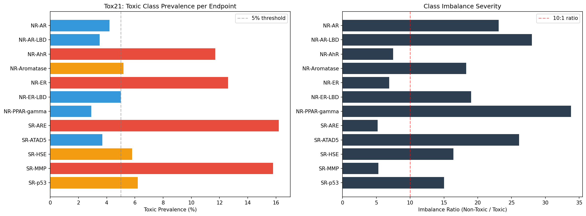
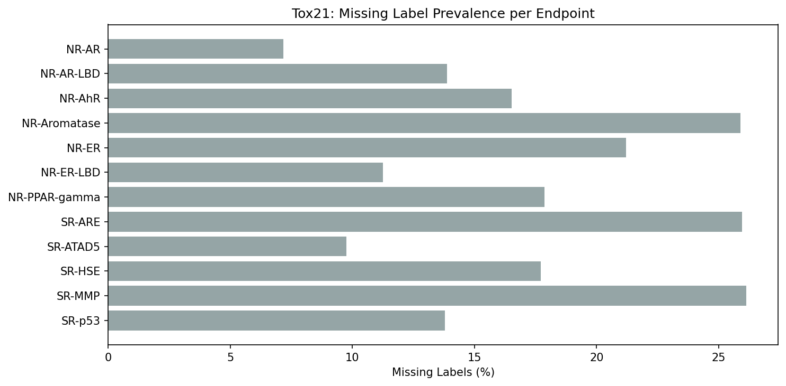
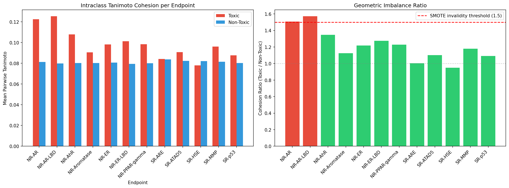
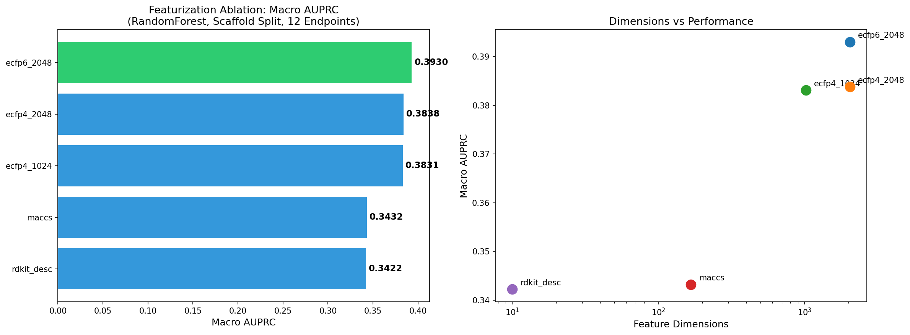
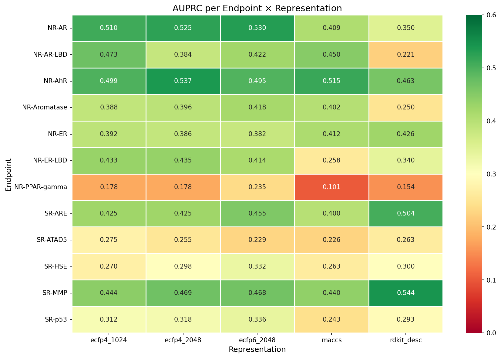
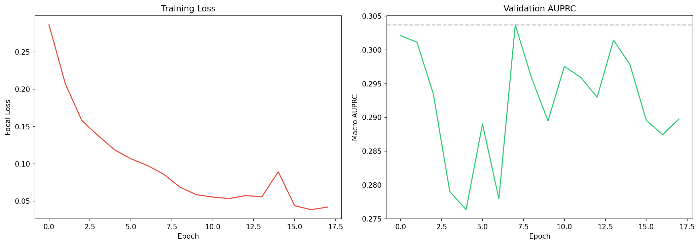
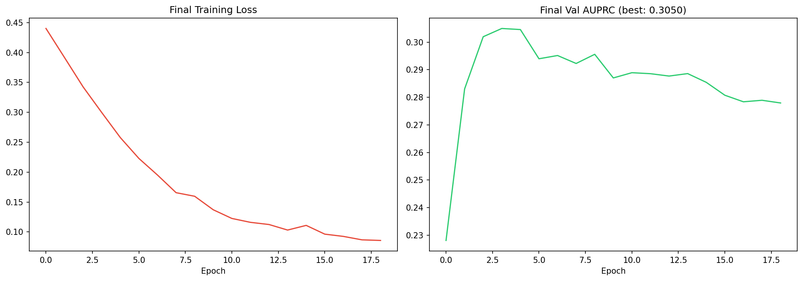
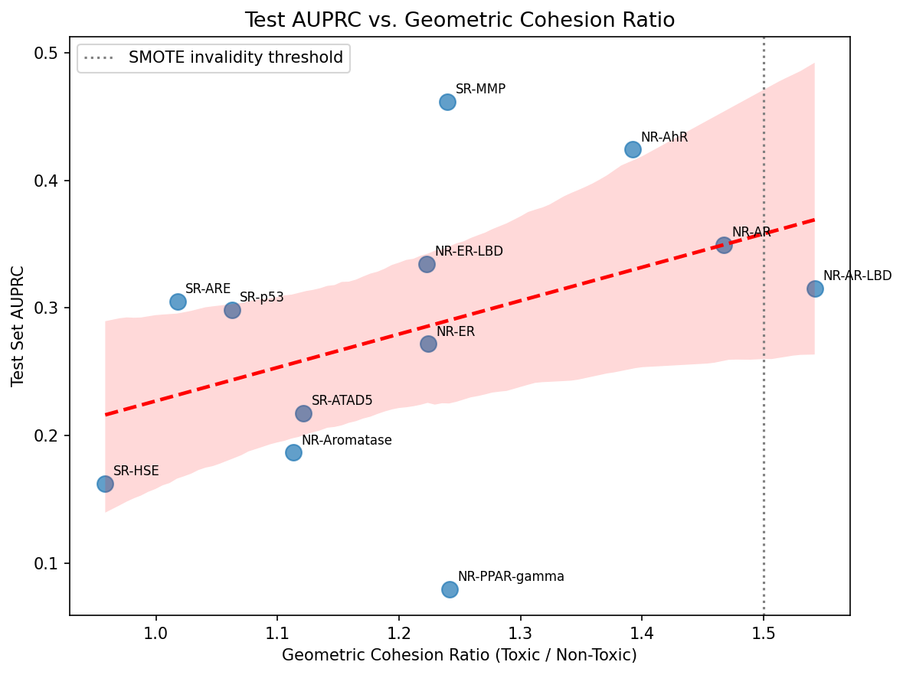

# ToxIntel™: Guide to Jupyter Notebook Graphs

This document explains every major graph generated by the Jupyter Notebooks in this project. You can use this guide to explain the visualizations in your report or presentation.

---

## 1. Exploratory Data Analysis (`01_EDA.ipynb`)

### A. Toxic Class Prevalence & Imbalance Severity

**What it shows:**
*   **Left Chart:** The percentage of toxic molecules per endpoint. Notice how low NR-PPAR-gamma is (~2.9%).
*   **Right Chart:** The imbalance ratio (Non-Toxic / Toxic). Shows how many safe molecules exist for every 1 toxic molecule.

**Key Takeaways:**
*   **Metric Failure:** Proves that standard classification metrics like Accuracy are completely invalid for this project.
*   **Algorithm Justification:** Visually justifies the absolute necessity for advanced techniques like Focal Loss (to focus on hard, rare examples) and AUPRC (Area Under Precision-Recall Curve) as the primary evaluation metric.

---

### B. Missing Label Distribution

**What it shows:**
*   A bar chart detailing the percentage of missing (NaN) labels for each of the 12 biological endpoints.

**Key Takeaways:**
*   **Data Fragmentation:** Shows that up to 26% of the data is missing for some assays (like NR-Aromatase).
*   **Custom Loss Requirement:** Justifies why we couldn't use standard PyTorch loss functions out-of-the-box. We had to build a custom `PerEndpointFocalLoss` that applies a "mask" to ignore `-1` (missing) values during training so the network isn't penalized for unknown data.

---

## 2. Geometric Imbalance Analysis (`02_Geometric_Imbalance.ipynb`)

### A. Intraclass Tanimoto Cohesion & Ratio

**What it shows:**
*   **Left Chart:** Compares the average structural similarity (Tanimoto score) of toxic molecules to each other vs. non-toxic molecules to each other.
*   **Right Chart:** The "Cohesion Ratio" (Toxic Cohesion / Non-Toxic Cohesion). A ratio > 1.5 (red line) indicates severe geometric clustering.

**Key Takeaways:**
*   **The Core Novelty:** This is the core novel finding of the project. It proves that for endpoints like NR-AR and NR-AR-LBD, toxic molecules are structurally clustered in a tight region of chemical space.
*   **SMOTE Warning:** Dictates where SMOTE (synthetic data generation) should *not* be used, as SMOTE on clustered data just reinforces the cluster rather than generating diverse examples.

---

## 3. Featurization Ablation Study (`03_Featurization_Ablation.ipynb`)

### A. Featurization Performance Comparison

**What it shows:**
*   **Left Chart:** Bar chart ranking 5 different ways of representing a molecule (ECFP4, ECFP6, MACCS, etc.) based on their Macro AUPRC.
*   **Right Chart:** Scatter plot relating the model performance (AUPRC) to the number of feature dimensions (e.g., MACCS is 167 bits, ECFP4 is 2048).

**Key Takeaways:**
*   **Feature Selection:** Empirically justifies the choice of combining ECFP4 fingerprints with descriptors (`ecfp4_desc`). 
*   **SHAP Compatibility:** Proves `ecfp4_desc` gives the best performance while retaining the `bitInfo` dictionary, which is mandatory for mapping SHAP attributions back to specific atoms in the prescription pipeline.

---

### B. AUPRC per Endpoint Heatmap

**What it shows:**
*   A color-coded grid showing how well each featurization method performed on *every individual endpoint*.

**Key Takeaways:**
*   **Granular Insight:** Provides a granular view showing that while `ecfp4_desc` is the best overall, certain endpoints respond slightly differently to different representations. It highlights the difficulty of multi-task learning across diverse biological targets.

---

## 4. ToxNet Training (`04_Training.ipynb`)

### A. Initial Training History (Sanity Check)

**What it shows:**
*   **Left Chart:** Training Focal Loss over epochs for an initial, un-optimized run.
*   **Right Chart:** Validation AUPRC over epochs for the initial run.

**Key Takeaways:**
*   **Convergence Check:** Proves that the basic architecture works and the custom masked Focal Loss correctly drives the network to learn before Optuna hyperparameter tuning begins.

---

### B. Final Optimized Model Training

**What it shows:**
*   The same loss and AUPRC curves, but for the final model trained with the best Optuna hyperparameters (e.g., 300 epochs, Cosine Annealing learning rate, Warmup).

**Key Takeaways:**
*   **Stable Learning:** The smooth curves and plateauing validation AUPRC validate the use of the Cosine Annealing scheduler and Warmup epochs. It proves the model achieves its peak predictive capability without catastrophically overfitting.

---

## 5. Evaluation & Calibration (`05_Evaluation.ipynb`)

### A. Test AUPRC vs. Geometric Cohesion Ratio

**What it shows:**
*   A scatter plot with a trendline. The X-axis is the Cohesion Ratio (from Notebook 2) and the Y-axis is the final Test Set AUPRC.

**Key Takeaways:**
*   **Proving Claim 1:** This ties the entire research narrative together. It visually supports Claim 1 of the research question.
*   **Structural Generalization:** Endpoints with high geometric cohesion (right side of the graph) generally generalize poorly on unseen scaffolds, resulting in lower AUPRC. It proves that structural clustering inherently limits a model's ability to generalize to new drugs.
